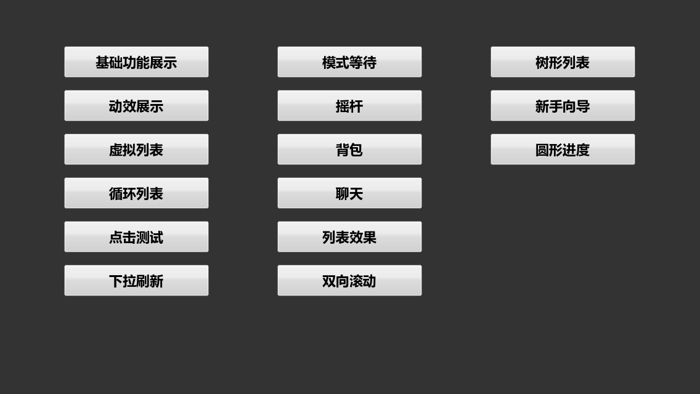
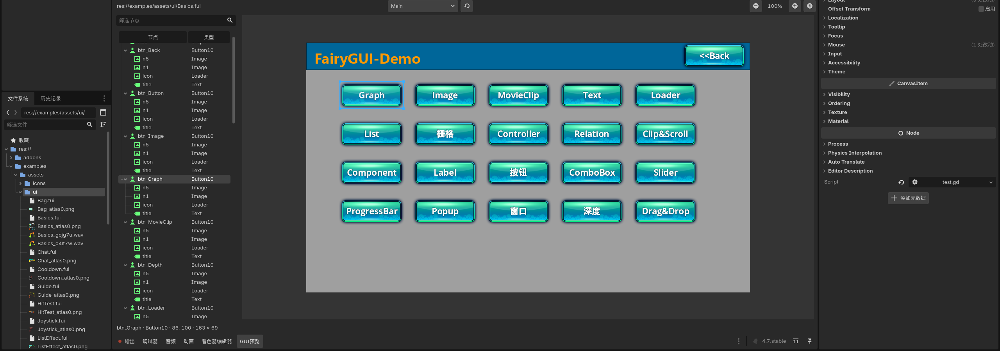

# FairyGUI Godot

FairyGUI Godot 是面向 Godot 4 的纯 GDScript FairyGUI 运行时与编辑器插件。它可以直接读取 FairyGUI Editor 导出的 `.fui` 包，在 Godot 编辑器中预览组件，并在运行时保持 FairyGUI 的包、组件、控制器、关系、Gear、Transition 和事件模型。

本项目不修改 Godot 源码，也不需要编译 GDExtension 或引擎模块。将插件目录放入项目并启用后即可使用。



## 主要功能

- 将 `.fui` 导入为 `FGUIPackageResource`，支持在 Inspector 中拖放资源和实时预览组件。
- 可将 `.fui` 或 GUI 预览中的组件直接拖入 Godot 2D 画布，自动创建并配置 `FGUIView`，支持 Undo/Redo。
- 内置“GUI预览”底部面板：双击 `.fui` 即可查看完整对象层级，支持节点筛选、双向选中、中键平移和滚轮缩放。
- 自动生成 `UI_<包名><组件名>` 强类型 GDScript，直接访问命名子对象、Controller 和 Transition，无需维护字符串映射。
- Inspector 可根据当前 `.fui` 的真实包 ID 和组件 ID 创建强类型业务脚本，并显示依赖、外部资源和绑定状态诊断。
- `FGUIView` Inspector 提供可视化事件绑定：从真实 FUI 层级选择对象和事件，自动生成处理函数，并随场景保存连接配置。
- 运行游戏时，Godot 调试器提供 `FairyGUI` 页签，可检查运行时逻辑树并在游戏中高亮选中对象。
- 支持未压缩及 raw-deflate 压缩的 FairyGUI 包、图集切片、依赖包和高分辨率资源分支。
- 支持组件、图片、动画、文本、富文本、输入框、Loader、Graph、Group、按钮、标签、进度条、滑动条、滚动条、下拉框、列表、树、窗口、弹窗等常用对象。
- 支持 Controller、Relation、Gear、Transition、路径动画、缓动、循环、暂停、时间缩放和嵌套动画。
- 支持鼠标与触摸输入、拖放、滚动、惯性、回弹、吸附、下拉刷新、横向滚动和列表选择。
- 支持虚拟列表、循环列表、对象池和按可视区域回收，适合大数据量列表。
- 支持 Scale9、平铺、颜色与灰度、常用混合模式、图形遮罩、反向遮罩、像素命中测试及多种进度填充方式。
- 支持位图字体、音频、翻译文本、异步 UI 构建、外部纹理和外部场景加载。
- `FGUILoader3D` 可显示 Godot 2D/3D 场景；Spine、DragonBones 等第三方运行时可通过内容工厂接入。

## 环境要求

- Godot 4.x。当前主要在 Godot 4.7 上开发和测试，不保证所有 Godot 4.x 小版本均完全兼容。
- FairyGUI Editor 导出的 `.fui` 文件及其图集、字体、音频等资源。
- 项目使用 GDScript；无需 C#、GDExtension 或自定义 Godot 构建。

## 安装

1. 将仓库中的 `addons/fairygui` 复制到目标 Godot 项目的 `addons` 目录。
2. 打开 Godot，在“项目设置 > 插件”中启用 `FairyGUI`。
3. 将 FairyGUI 导出的 `.fui` 和关联资源放入项目，等待 Godot 完成导入。

建议将 `.fui` 及对应的 `.fui.import` 文件一并纳入版本管理，以保持资源 UID 和导入结果稳定。

## 编辑器预览

1. 在场景中创建一个空的 `Control`。
2. 挂载 `res://addons/fairygui/ui/fui_view.gd`，或直接创建 `FGUIView` 节点。
3. 将 `.fui` 文件拖到 Inspector 的 `package` 属性。
4. 在 `component_name` 中选择需要显示的组件。

`FGUIView` 提供以下常用选项：

- `preview_in_editor`：是否在编辑器中显示预览。
- `resize_to_content`：是否让节点尺寸跟随 FairyGUI 组件。
- `match_control_size`：是否让 FairyGUI 组件匹配当前 `Control` 尺寸。

参考场景位于 `examples/editor_preview/fui_preview.tscn`。

### GUI 预览面板



在文件系统中双击 `.fui` 后，插件会打开底部的“GUI预览”面板。面板左侧递归展示当前组件的完整 FairyGUI 对象层级，右侧显示实际渲染结果：

- 包内组件可以直接切换，默认优先选择 `Main`。
- 左侧支持按节点名和类型筛选。
- 点击左侧节点会在预览中绘制选框并定位到对应对象。
- 点击右侧预览对象会反向选中并展开左侧节点。
- 支持中键拖动画布、滚轮以鼠标位置为中心缩放、适应窗口和重新加载。
- Inspector 中的“打开预览”也可以打开当前 `FGUIPackageResource` 或 `FGUIView`。
- 重新导入、重新加载和组件往返切换时，会恢复节点选择、折叠状态、筛选、缩放和滚动位置。

详细行为见 [GUI 预览面板设计](docs/GUI_PREVIEW.md)。

如果希望业务脚本直接挂在同一个预览节点上，脚本必须标记为 `@tool` 并继承 `FGUIView`，否则 Godot 编辑器不会执行预览逻辑，`component_name` 也不会显示组件下拉选项：

```gdscript
@tool
extends FGUIView

var ui: UI_InventoryMain


func _ready() -> void:
	super._ready()
	if Engine.is_editor_hint():
		return
	ui = fairy as UI_InventoryMain
	ui.item_list.on(FGUIEvents.CLICK_ITEM, _on_item_clicked)
```

同节点模式下不能使用 `@onready var ui = fairy`，因为 `fairy` 由 `FGUIView._ready()` 创建；应先调用 `super._ready()`，再取得强类型对象。使用父 `Control` 管理子 `FGUIView` 时，则可以继续使用下面的 `@onready` 写法。

## 强类型绑定与代码生成

插件可以直接从 `.fui` 生成 GDScript 组件类，不需要在业务代码中维护名称字典。默认输出目录为 `res://generated/fairygui`，类名格式为 `UI_<包名><组件名>`。

生成方式：

- `.fui` 重新导入后自动生成。
- 使用 Godot 菜单“项目 > 工具 > Generate FairyGUI Bindings”。
- 在 `FGUIPackageResource` 或 `FGUIView` Inspector 中点击“生成绑定”。

为 `FGUIView` 配置 package 和 component 后，可以点击 Inspector 中的“创建界面脚本”。插件会先解析当前 `.fui` 的真实包 ID 与组件 ID，再从生成清单定位对应绑定脚本。模板使用实际绑定路径：

```gdscript
@tool
extends FGUIView

const UI_TYPE := preload("res://generated/fairygui/<实际生成路径>.gd")

var ui: UI_TYPE
```

模板不会固定生成 `UI_BasicsMain`，也不会仅根据 `.fui` 文件名猜测类型。已有业务脚本时，按钮会变为“打开界面脚本”。

## 可视化事件绑定

配置了界面脚本的 `FGUIView` 会在 Inspector 中显示“FairyGUI 事件绑定”面板：

1. 选择 `.fui` 中的真实命名对象。
2. 选择该对象支持的点击、状态、列表、滚动、拖动或文本事件。
3. 确认自动建议的处理函数名并点击“连接事件”。

插件会把连接信息序列化到 `FGUIView.event_bindings`，并在界面脚本末尾生成缺失的处理函数：

```gdscript
func _on_start_button_clicked(event: FGUIEventContext) -> void:
	print(event.sender, event.data)
```

也可以先从 `FGUIView` Inspector 打开 GUI 预览，在层级树或画布中选择对象，然后点击“绑定事件”。插件会返回场景中的 `FGUIView`，并在 Inspector 中自动选中同一 FUI 目标。

事件在运行时由 `FGUIView` 自动连接；组件重新创建后会先断开旧对象再连接新对象，避免重复触发。`FGUIEventContext` 使用对象池，只应在回调期间读取，不要长期持有引用。

场景中的 `FGUIView` 设置 `package` 和 `component_name` 后，业务脚本可以直接使用生成类型：

```gdscript
extends Control

@onready var ui: UI_InventoryMain = %InventoryView.fairy as UI_InventoryMain


func _ready() -> void:
	if ui == null:
		return
	ui.item_list.add_event_listener(FGUIEvents.CLICK_ITEM, _on_item_clicked)
	ui.page.selected_index = 0


func _on_item_clicked(event: FGUIEventContext) -> void:
	print(event.data)
```

生成类会绑定所有有语义名称的子对象、Controller 和 Transition。默认忽略 `n0`、`n1` 等 FairyGUI 自动名称；绑定按名称执行，不依赖子对象索引。当前生成集合中的嵌套组件也会使用对应生成类型，循环引用会安全回退到内置基类。branch 公共成员保持强校验，分支特有成员允许为 `null`。

## 运行时检查

从 Godot 编辑器运行项目后，调试器会出现 `FairyGUI` 页签。点击“刷新”可以读取所有运行中的 `FGUIView` 及其递归对象树；选择对象后，游戏窗口会显示对应边界。该桥接只在 `EngineDebugger` 可用时创建，发布构建不会启用。

第一阶段编辑器工作流的约束和验收标准见 [编辑器工作流第一阶段规范](docs/EDITOR_WORKFLOW_PHASE1_SPEC.md)。

第二阶段事件绑定工作流的约束和验收标准见 [编辑器工作流第二阶段规范](docs/EDITOR_WORKFLOW_PHASE2_SPEC.md)。

常用项目设置位于 `fairygui/codegen`：

- `auto_generate`：导入后是否自动生成，默认开启。
- `output_dir`：生成类和清单目录。
- `registry_path`：运行时自动注册表路径。
- `class_prefix`：生成类名前缀，默认 `UI_`。
- `include_default_names`：是否包含 `n<number>` 自动名称，默认关闭。
- `include_internal_components`：是否为未标记 Exported 的内部组件生成类，默认关闭；完整演示工程会开启以展示列表 Item 等内部类型绑定。

单个 `.fui` 可以在 Godot Import 面板中通过 `codegen/enabled` 排除；下次手工或自动生成会同步更新该包的注册项和生成文件。

生成文件与业务脚本完全分离，内容未变化时不会重写。生成失败会保留上一份可用结果；手工 `FGUIObjectFactory.set_extension()` 始终优先于自动注册。导出插件会显式加入注册表和生成脚本，兼容仅导出所选场景依赖的发布配置。建议将生成目录纳入版本管理，使 CI 和正式构建使用确定的绑定代码。

完整设计契约见 [强类型绑定代码生成规范](docs/CODEGEN_SPEC.md)。

## 运行时使用

下面的示例加载 `res://ui/Main.fui`，创建其中的 `Main` 组件并加入 FairyGUI 根节点：

```gdscript
extends Control

var _package: FGUIPackage
var _view: FGUIComponent


func _ready() -> void:
	var root := FGUIRoot.get_inst()
	root.attach_to(self)

	_package = FGUIPackage.add_package("res://ui/Main")
	if _package == null:
		return

	_view = _package.create_object("Main") as FGUIComponent
	if _view == null:
		return

	root.add_child(_view)
	_view.make_full_screen()

	var start_button := _view.get_child("start")
	if start_button != null:
		start_button.on(FGUIEvents.CLICK, _on_start_clicked)


func _on_start_clicked(_event: Variant) -> void:
	print("start")
```

也可以不使用 `FGUIRoot`，直接把对象对应的 Godot 节点加入现有场景树：

```gdscript
var package := FGUIPackage.add_package("res://ui/Inventory")
var inventory := package.create_object("Main")
add_child(inventory.node)
```

## 示例

- `demo.tscn`：完整示例入口，覆盖基础控件、Transition、虚拟列表、循环列表、命中测试、下拉刷新、窗口、拖放、树、遮罩和冷却效果等功能。
- `examples/minimal/main.tscn`：最小运行时接入示例。
- `examples/editor_preview/fui_preview.tscn`：`.fui` Inspector 资源与编辑器预览示例。
- `examples/event_binding/event_binding_demo.tscn`：场景化事件绑定、自动处理函数和运行时连接示例。

直接使用 Godot 打开仓库并运行项目，即可进入完整示例。

完整 Demo 已改为强类型绑定写法，主界面、各功能页、窗口、列表 Item 和 Controller 均直接访问 `UI_*` 生成成员。演示工程为了覆盖旧示例中的 `n<number>` 和内部 Item，开启了 `include_default_names` 与 `include_internal_components`。更新 `.fui` 后可运行：

```powershell
godot --headless --path . --script res://tools/generate_demo_bindings.gd
```

## 商业项目使用

本项目采用 MIT License，可用于个人和商业项目。正式上线前仍应使用项目自己的 `.fui` 包、字体、语言、输入方式和目标设备完成回归测试，并根据实际界面规模进行性能分析。

建议在生产项目中遵循以下原则：

- 大数据列表使用虚拟列表和对象池，避免一次创建全部 Item。
- 高频变化的复杂遮罩、超大位图文本和大量同时运行的 Transition 需要在目标设备上测量开销。
- Spine、DragonBones 等内容应使用项目已获得授权并适配 Godot 的运行时。
- `examples` 中的演示资源用于功能展示和兼容性验证，产品发布前应确认其授权范围或替换为自有资源。

## 当前兼容边界

- Transition 的 `skew` 动作暂不支持。
- FairyGUI 自定义混合槽位 1-3 当前按普通混合模式处理。
- Spine、DragonBones 不随插件捆绑，需要通过 `FGUILoader3D.set_content_factory` 接入对应运行时。
- 本项目面向 Godot 4.x，仓库工程及当前回归测试使用 Godot 4.7；其他 Godot 4.x 小版本需要由项目自行验证。

## 项目结构

```text
addons/fairygui/          FairyGUI 运行时、编辑器导入器与预览组件
generated/fairygui/       完整 Demo 使用的自动生成强类型绑定
examples/                 完整示例、最小接入示例及示例资源
tools/                    Demo 绑定维护脚本
demo.tscn                 示例项目入口
project.godot             示例项目配置
```

## 许可

项目新增代码使用 [MIT License](LICENSE.md)。FairyGUI 上游版权声明及演示资源说明见 [THIRD_PARTY_NOTICES.md](THIRD_PARTY_NOTICES.md)。

MIT License 不包含任何质量担保。使用方需要自行确认第三方资源、字体、音频及外部运行时的授权。
